  

  [Portfolio](https://davidz1407.github.io/Portfolio/index.html) · [LinkedIn](https://www.linkedin.com/in/david-zahn-3829a1364/) · [GitHub](https://github.com/DavidZ1407) · [Email](mailto:David-zahn@hotmail.com)

Games & Immersive Media student at **Hochschule Furtwangen**, focused on **gameplay programming**, **gameplay systems** and **systems design**. Alongside that I work in **3D art**, **level design** and **web development**, and on team projects.

Currently open to roles in **gameplay programming**, **gameplay / systems design**, **game development** and **3D art**.

  

## Featured Projects

- **[Gothica Solaris](https://github.com/DavidZ1407)** — first-person roguelite dungeon crawler · 6-week team project · **Godot / C#** · gameplay systems, AI, level design, 3D assets, Scrum Master
- **[Godot Island Generator](https://github.com/DavidZ1407/Terrain-Generator)** — procedural island generator with biome mapping, animated water shaders and toon-style rendering · **Godot / GDScript**
- **[Portfolio & Web Projects](https://davidz1407.github.io/Portfolio/index.html)** — interactive web experiences and graphics built with **HTML / CSS / TS** and **WebGL / GLSL**

  

## Let's Connect

  
  
  
  

## Tools & Technologies

**Game Development**

  

**3D & Art**

 

**Web & Graphics**

    

**Audio**

  <b>David Zahn</b> · Games & Immersive Media

